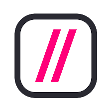

# api_rest_banco

<div align=center>    
   
   <p>Cubos Academy</p>
   <p>API desenvolvida por Mariana Galindo</p>
</div>


 ## 📚 Sobre
<p>Essa é uma API REST foi desenvolvida com o propósito de alcançar a aprovação no segundo desafio do Bootcamp com ênfase em Backend da Cubos Academy. Seu escopo abrange os conteúdos ministrados durante as aulas do módulo 2 do programa, evidenciando uma aplicação prática dos conhecimentos adquiridos.</</p>

## 📌 Passos para executar o projeto
```bash
# Clonar o repositório remoto
$ git clone https://github.com/marianagsoares/desafio-backend-m02-b2bt05.git
```
```bash
# Instalação das depedências
$ npm install
```
```bash
# Inicialiar o projeto
$ npm run dev
```
 ### 💰 Rotas CRUD de contas bancárias

|Métodos |  Endpoint      |      Rotas             | Status |
| ------ | -------------  | -----------------------| ------ |
| GET    | /contas        |  Listar contas         |   200  |  
| GET    | /contas/:id    |  Listar contas por id  |   200  |
| POST   | /contas        |  Criar conta           |   201  |
| PUT    | /contas/:id    |  Editar conta por id   |   200  |  
| DELETE | /contas/:id    |  Deletar conta por id  |   204  |

 ### 💸 Rotas de operações bancárias

|Métodos |  Endpoint             |      Rotas             | Status |
| ------ | -------------         | -----------------------| ------ |
| POST   | transacoes/depositar   |  Depositar             |  200   |
| POST   | transacoes/sacar       |  Sacar                 |  200   |
| POST   | transacoes/transferir  |  Transferir            |  200   |
| GET    | contas/saldo          |  Saldo                 |  200   |
| GET    | contas/extrato        |  Extrato               |  200   |

## 📞 Contato
<div>
   <br>
   <a href = "mailto:marianasoares.ti@gmail.com"></a>
   <a href="https://www.linkedin.com/in/mariana-galindo-391413220/" target="_blank"></a> 
 <br>